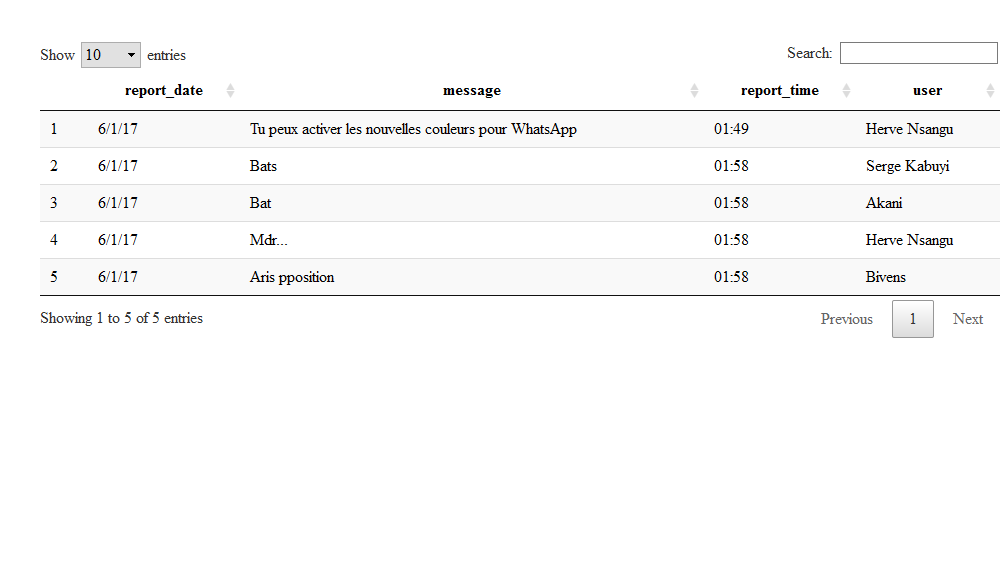
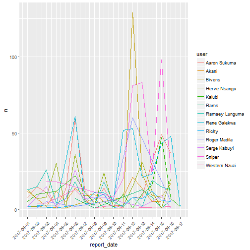
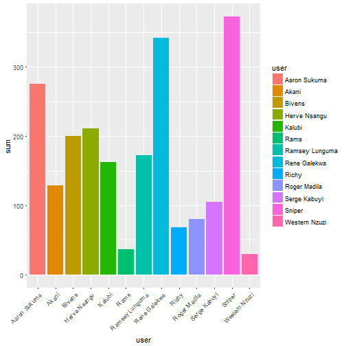
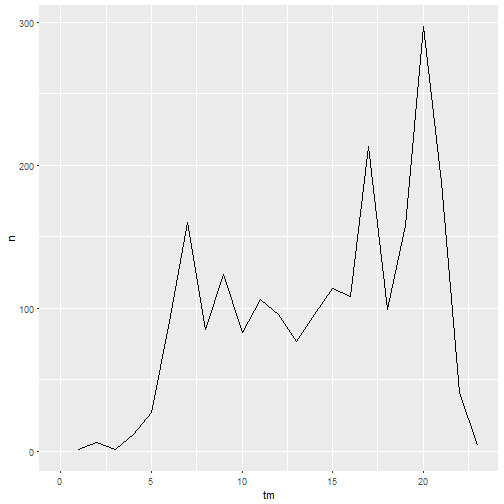
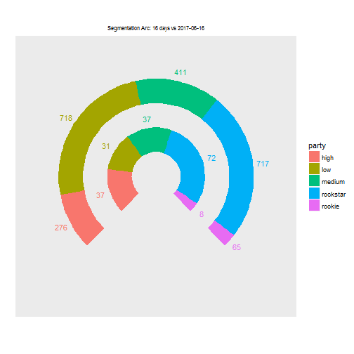
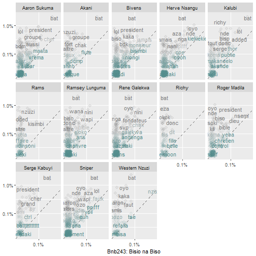
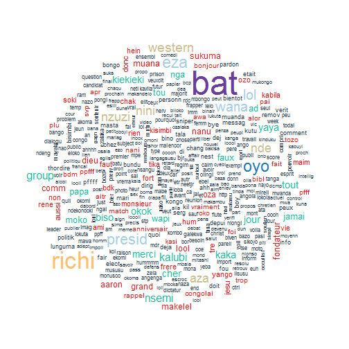
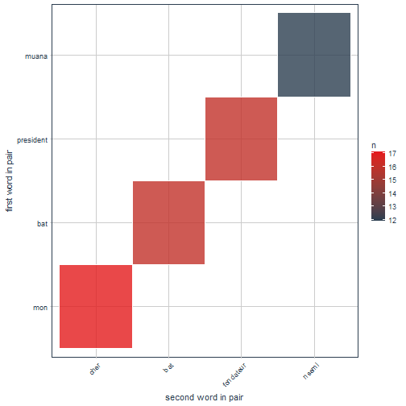
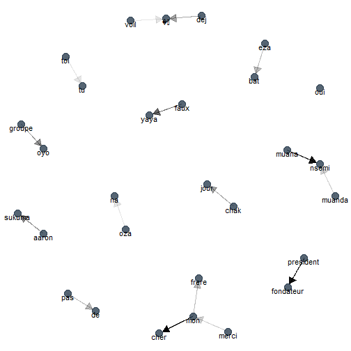

## Introduction

I've seen my phone number be added in many WhatsApp groups since I bought a smartphone. Most of creators usually pronounce a pretty kind speech in the beginning detailing reasons we should be together. 

For example : __**--"Hi Everyone! We've been friends for a long time and most of us left the city (ward or country). I created this group in order for us to communicate with each other and keep in touch". --"Hi guys! As you know the unemployment rate has dramatically increased in our country. Therefore, I created this group for sharing job offers (or opportunities)"**__.

In opinion, these statements make sense and it's worth it to share information with friends hunting for a job opportunity.

However, more progressively the number of members increases, the group objectives are trampled on. **_Everyone wants to talk of his own business_ _--everyone wants to lead a topic_ _--everyone wants to post Toto's stories and riddles_**. It makes it messy and awkward. As result, people get frustrated and leave the group. I am not against any group this is my personal experience. Maybe, I'm wrong! 

In contrast of this sad experience I still like to be a part of groups created by friends. I particularly like the way the __**BnB+243**__ works. A crazy communication style, quirks and teasing! This makes it funny and amazing! And even though I no longer post anything, I do think it's an ideal group you should belong to.

The group has been re-created several times because of the leadership issues. It gathers friends from the University of Kinshasa (School of Maths & Computer Alumni, Fiscal year 2012).

In this post, I would like to use chat history from 2017-06-01 to 2017-06-16. This data comes from an unstructured source. I'm going to tidy it in a tabular format and explore trends and tell stories. Also, I am going to apply text mining techniques to highlight the word cloud and perform the n-gram prediction.


## 1. Data Load & Exploratory Data Analysis


```r
bnb <- readLines("~/WhatsApp_bnb.txt")
```
Let's print the five first lines.


```r
head(bnb, n=5)
```

```
## [1] "6/1/17, 01:49 - Herve Nsangu: Tu peux activer les nouvelles couleurs pour WhatsApp, en cliquant ici. https://t.co/kVYhKKVy73"
## [2] "6/1/17, 01:58 - Serge Kabuyi: Bats"                                                                                          
## [3] "6/1/17, 01:58 - Akani: Bat"                                                                                                  
## [4] "6/1/17, 01:58 - Herve Nsangu: Mdr..."                                                                                        
## [5] "6/1/17, 01:58 - Bivens: Aris pposition"
```
In the first line **Herve Nsangu** has tried to introduce a tricky method for activating the env color on WhatsApp... **Aris and Serge** both roughly replied using the same word pretending to be already informed of it. And so on.


Here below, I will tidy the data in a consistent format in four columns, namely __(report_date, report_time, message, user)__


```r
names(bnb) <-  c("report_date", "message", "nothing")
data <- bnb %>% 
       mutate(
           report_time = str_match(message, "[0-9]{2}:[0-9]{2}"),
           report_time = as.character(report_time),
           message = gsub(pattern = "[0-9]{2}:[0-9]{2} - ", replacement = "", message),
           user = str_match(message, 
                       "Aaron Sukuma|Serge Kabuyi|Kalubi|Herve Nsangu|
                        NBA|Richy|Bivens|Sniper|Rene Galekwa|Ramsey Lunguma|
                        Louis Muchanga|Roger Madila|Akani|Rams|Western Nzuzi"),
           user = as.character(user),
           message = gsub(pattern = 
                        "Aaron Sukuma: |Serge Kabuyi: |Kalubi: |Herve Nsangu: |NBA: |Richy: 
                        |Bivens: |Sniper: |Rene Galekwa: |Ramsey Lunguma: |Louis Muchanga:   
                        |Roger Madila: |Akani: |Rams: |Western Nzuzi :", 
                      replacement = "", message)
                  ) %>% 
      select(-nothing)

data <- na.omit(data)
```

See below the tidied data: 


```r
data %>% 
  head(5) %>% 
  datatable()
```



Since my dataset gets tidy I can seamlessly sum up the daily activity of each member. The objective is to plot trends depicting the contributions of members.


```r
data %>% 
      filter(!is.na(user)) %>% 
      mutate(p = nchar(report_date)) %>% 
      mutate(report_date = lubridate::mdy(report_date)) %>% 
      count(report_date, user) -> t_data

t_data %>% 
      ggplot(aes(x=report_date, y=n, group=user, colour=user)) +
      geom_line() + scale_x_date(breaks = date_breaks("day")) +
      theme(axis.text.x = element_text(angle = 45, hjust = 1)) 
```



First, I've exempted the text message in order to present contributions. According to my own commitment *contribution* means what a member has pushed into the chat room (text, picture, video, smiley, voice, etc.)


```r
t_data %>% 
  spread(report_date,n) %>%
  replace_na(list( `2017-06-01`=0, `2017-06-02`=0, `2017-06-03`=0, `2017-06-04`=0,`2017-06-05`=0,
                   `2017-06-06`=0, `2017-06-07`=0, `2017-06-08`=0, `2017-06-09`=0, `2017-06-10`=0,
                   `2017-06-11`=0, `2017-06-12`=0, `2017-06-13`=0, `2017-06-14`=0,`2017-06-15`=0,
                   `2017-06-16`=0  
                   )) %>% 
  select(-`2017-06-17`) -> o_data

o_data %>% kable()
```


|user           | 2017-06-01| 2017-06-02| 2017-06-03| 2017-06-04| 2017-06-05| 2017-06-06| 2017-06-07| 2017-06-08| 2017-06-09| 2017-06-10| 2017-06-11| 2017-06-12| 2017-06-13| 2017-06-14| 2017-06-15| 2017-06-16|
|:--------------|----------:|----------:|----------:|----------:|----------:|----------:|----------:|----------:|----------:|----------:|----------:|----------:|----------:|----------:|----------:|----------:|
|Aaron Sukuma   |          8|         15|         11|          2|         13|         59|         12|          4|         14|          3|          2|          8|          8|         31|         49|         37|
|Akani          |         12|          7|          2|         12|          5|         14|          9|         10|          5|          0|          8|         21|         14|          5|          5|          0|
|Bivens         |          2|          2|          0|          0|          1|          0|          0|          7|          1|          0|          1|        129|         23|          9|          8|         17|
|Herve Nsangu   |         13|          7|          8|         30|          1|         36|          5|          3|         24|          2|          3|         15|         31|         12|          1|         20|
|Kalubi         |          5|         10|          0|         12|          0|         22|         11|          4|          5|          2|         10|          1|         10|         16|         47|          7|
|Rams           |          0|          0|          0|          0|          0|          7|          0|          1|          0|          0|          0|          0|         13|          8|          1|          6|
|Ramsey Lunguma |         13|         15|         26|          4|          7|         18|          4|          3|         18|          5|          2|          8|          2|         19|         15|         13|
|Rene Galekwa   |          2|          0|          3|          3|          0|         61|          5|         11|         11|          6|         52|         53|         21|         23|         43|         48|
|Richy          |          0|          2|          0|          1|          0|          3|          3|          7|         10|          1|          3|          8|          7|         12|          6|          5|
|Roger Madila   |          1|          1|          5|          0|          0|          2|          0|          0|          0|          6|          0|         60|          0|          0|          0|          5|
|Serge Kabuyi   |          2|          8|         15|          1|          7|         26|          7|          8|          8|          6|          0|          0|          2|          5|          9|          1|
|Sniper         |          0|          0|         18|         18|          0|          0|          0|          0|          0|          8|         20|         81|         83|         23|         98|         24|
|Western Nzuzi  |          0|          4|          4|          0|          0|         13|          0|          1|          0|          3|          1|          1|          0|          0|          0|          2|

Hopefully the table above tells us stories about members of the group. I'm going to add some columns involving descriptive statistical methods __(mean and sum)__ 


```r
o_data %>% 
  mutate(sum = rowSums(.[2:17]),
         mean= rowMeans((.[2:17]))) -> o_data
o_data %>% kable()
```


|user           | 2017-06-01| 2017-06-02| 2017-06-03| 2017-06-04| 2017-06-05| 2017-06-06| 2017-06-07| 2017-06-08| 2017-06-09| 2017-06-10| 2017-06-11| 2017-06-12| 2017-06-13| 2017-06-14| 2017-06-15| 2017-06-16| sum|    mean|
|:--------------|----------:|----------:|----------:|----------:|----------:|----------:|----------:|----------:|----------:|----------:|----------:|----------:|----------:|----------:|----------:|----------:|---:|-------:|
|Aaron Sukuma   |          8|         15|         11|          2|         13|         59|         12|          4|         14|          3|          2|          8|          8|         31|         49|         37| 276| 17.2500|
|Akani          |         12|          7|          2|         12|          5|         14|          9|         10|          5|          0|          8|         21|         14|          5|          5|          0| 129|  8.0625|
|Bivens         |          2|          2|          0|          0|          1|          0|          0|          7|          1|          0|          1|        129|         23|          9|          8|         17| 200| 12.5000|
|Herve Nsangu   |         13|          7|          8|         30|          1|         36|          5|          3|         24|          2|          3|         15|         31|         12|          1|         20| 211| 13.1875|
|Kalubi         |          5|         10|          0|         12|          0|         22|         11|          4|          5|          2|         10|          1|         10|         16|         47|          7| 162| 10.1250|
|Rams           |          0|          0|          0|          0|          0|          7|          0|          1|          0|          0|          0|          0|         13|          8|          1|          6|  36|  2.2500|
|Ramsey Lunguma |         13|         15|         26|          4|          7|         18|          4|          3|         18|          5|          2|          8|          2|         19|         15|         13| 172| 10.7500|
|Rene Galekwa   |          2|          0|          3|          3|          0|         61|          5|         11|         11|          6|         52|         53|         21|         23|         43|         48| 342| 21.3750|
|Richy          |          0|          2|          0|          1|          0|          3|          3|          7|         10|          1|          3|          8|          7|         12|          6|          5|  68|  4.2500|
|Roger Madila   |          1|          1|          5|          0|          0|          2|          0|          0|          0|          6|          0|         60|          0|          0|          0|          5|  80|  5.0000|
|Serge Kabuyi   |          2|          8|         15|          1|          7|         26|          7|          8|          8|          6|          0|          0|          2|          5|          9|          1| 105|  6.5625|
|Sniper         |          0|          0|         18|         18|          0|          0|          0|          0|          0|          8|         20|         81|         83|         23|         98|         24| 373| 23.3125|
|Western Nzuzi  |          0|          4|          4|          0|          0|         13|          0|          1|          0|          3|          1|          1|          0|          0|          0|          2|  29|  1.8125|

```r
ggplot(data=o_data, aes(x=user, y=sum, fill=user)) + geom_bar(stat="identity") +
  theme(axis.text.x = element_text(angle = 45, hjust = 1)) 
```



**Ramsey Lunguma, Herve Nsangu and Aaron Sukuma** seem to be a regular everyday in the group. May we call them Rockstar? Do they have more time for typing? or Are they the most sympathetic? I think Artificial Intelligence tools like IBM Watson could answer such questions from text-based discussions. Since it analyses this kind of problems in depth involving the definition and synonyms of words... Unlikely for me I won't tackle this point here.

In 16 days, **Sniper** has only contributed 9 times. To the great dismay, he's leading the total of all contributions. Does he have more megabytes? Did he lead a discussion? I think the first question can be very complex to answer since browsing does not depend to the internet package you have but to the purpose. However, the second question deserves an answer using text analysis.

I'm curious to see **Rams and Western Nzuzi** coming at the tail of the list. They didn't contribute as much than other members. What could be the reasons? Do they have some restrictions at work in relation with the phone? Are they married? Is there any marital restriction in relation with the phone? Is there an electricity issue? It is tedious to answer these questions. It could be seen as an invasion of privacy... The data also cannot answer it. I also assume that it's not mandatory to participate in group discussion. 

### Hourly Activity

It's very impressive to discover that these guys do not rest. Between 12PM and 1AM they take a short break, afterwards the chat continues at a weaker pace.
In the dawn, the discussion normally restarts. What can they share at 5AM? **_--Nightmare experience? --Downloading files --Enjoying high-speed internet_**. From 4PM to 8PM, it's the end of the business day for one another, they get the advantage of spare time to hook up for discussing world news, sport, music, politics and miscellaneous. Around 10 PM activities drop like a waterfall, probably because they are exhausted.


```r
data %>% 
  mutate(tm = paste0(lubridate::mdy(report_date), " ", report_time, " WAT"),
         tm = lubridate::as_datetime(tm),
         tm = as.numeric(substr(tm,sqrt(144),sqrt(169)))
         ) -> db
db %>% 
  count(tm) %>% 
  ggplot(aes(tm, n)) + geom_line() + xlim(c(0,23))
```



### Segmentation

I decide to stratify the dataset in five segments as follows:

+ **_rockstar_**: contribution greater than 300
+ **_high_**: contribution between 250 and 299
+ **_medium_**: contribution between 200 and 249
+ **low**: contribution between 51 and 199
+ **rookie**: contribution between 0 and 50


```r
data %>%
  count(user) %>% 
  mutate(segment=case_when(
                 n >= 300 ~ "rockstar",
                 n %in% 250:299 ~ "high",
                 n %in% 200:249 ~ "medium",
                 n %in% 51:199 ~ "low",
                 n %in% 0:50 ~ "rookie")) -> seg_data
  seg_data %>% kable()
```


|user           |   n|segment  |
|:--------------|---:|:--------|
|Aaron Sukuma   | 276|high     |
|Akani          | 129|low      |
|Bivens         | 200|medium   |
|Herve Nsangu   | 211|medium   |
|Kalubi         | 164|low      |
|Rams           |  36|rookie   |
|Ramsey Lunguma | 172|low      |
|Rene Galekwa   | 344|rockstar |
|Richy          |  68|low      |
|Roger Madila   |  80|low      |
|Serge Kabuyi   | 105|low      |
|Sniper         | 373|rockstar |
|Western Nzuzi  |  29|rookie   |

**Rene Galekwa and Sniper** are the _rockstars_ of the group whereas **Rams and Western Nzuzi** are both viewed as _rookies_.


Note: This chart below represents the score realized per segment in the entire data (i.e from 2017-06-01 to 2017-06-16) and in the subset of 2017-06-16.


```r
  merge(seg_data, o_data, by.x='user', by.y='user') %>% 
  select(segment,n, `2017-06-16`) %>% 
  group_by(segment) %>% 
  summarise(seg=sum(n), segsub=sum(`2017-06-16`)) %>% 
  ggparliament(party = segment, seats1 = seg, seats2 = segsub, style = "arc", label = "seats") + 
  ggtitle("Segmentation Arc: 16 days vs 2017-06-16") + theme(plot.title = element_text(size=8)) +
  theme(plot.title = element_text(hjust = 0.5))
```



+ Entire dataset
   
   1. **Rene Galekwa + Sniper** = 717 (`33%`)
   2. **Rams + Western Nzuzi** = 65 (`3%`)

+ On 2017-06-16
  
   1. **Rene Galekwa + Sniper** = 72 (`39%`)
   2. **Rams + Western Nzuzi** = 8 (`4%`)


## 2. Text Analytics

The most used words in this chat group (from June 1 to June 16) are: 

+ [BDK and Nsemi](https://en.wikipedia.org/wiki/Bundu_dia_Kongo)
+ [DCMP](https://en.wikipedia.org/wiki/Daring_Club_Motema_Pembe)
+ Bière (beer)
+ Bat
+ President
+ [Angenga](http://www.radiookapi.net/mot-cle/prison-angenga)
+ Kisimbi (or bisimbi)
+ Chanvre
+ Flute
+ Thor (or tchor or tshor)
+ Pfff
+ Jesus
+ [Affaire Alexis](http://www.rfi.fr/afrique/20170615-rdc-ministre-justice-thambwe-mwambavise-enquete-belgique-cal-avion-abattu)


```r
text_an <- data %>% 
            select(message,user) %>% 
            mutate(text = purrr::as_vector(paste0(message))) %>%
            select(user, text) %>%
            unnest_tokens(word,text) %>%
            filter(
                      nchar(word) > 2, 
                      !word %in% tm::stopwords("french"),
                      !word %in% tm::stopwords("english"),
                      !str_detect(word, "[:digit:]"),
                      !word %in% c("cest","bon","bien", "oui")) %>%
            select(user, everything())

gp_term <- text_an %>%
              anti_join(stop_words) %>%
              count(word) %>%
              transmute(word, all_words = n / sum(n))

text_an %>%
           filter(tolower(user) != tolower(word)) %>% 
           anti_join(stop_words) %>%
           count(user, word) %>%
           mutate(user_words = n / sum(n)) %>%
           left_join(gp_term) %>%
           arrange(desc(user_words)) %>%
           ungroup() %>%
           ggplot( aes(x = user_words, y = all_words, color = abs(all_words - user_words))) +
           geom_abline(color = "gray40", lty = 2) +
           geom_jitter(alpha = 0.1, size = 2.5, width = 0.1, height = 0.1) +
           geom_text(aes(label = word), check_overlap = TRUE, vjust = 0.5) +
           scale_x_log10(labels = scales::percent_format()) +
           scale_y_log10(labels = scales::percent_format()) +
           scale_color_gradient(limits = c(0, 0.001), low = "darkslategray4", high = "gray75") +
           facet_wrap(~ user, ncol = 5) + theme(legend.position="none") +
           labs(x = "Bnb243: Bisio na Biso", y = NULL) 
```



### Word cloud



### The most common word pairs (bigrams) 



In fact, it's tough to filter conversation topics (that do not fit with the group objectives) on WhatsApp since this option is not available. However, I would like to hear from the group admin whether this list of most used words is part of group objectives. If no, then, I agree with those members who decide to leave the group. 

For keeping the equilibrium, satisfaction and comfort into the group, I would like to propose these features:

  - Because it's boring to discuss one topic for a long time, we can set up many discussion topics in a single group chat while creating it.
  - And setting hidden [chatbot](https://en.wikipedia.org/wiki/Chatbot) susceptible to filter deviated messages


